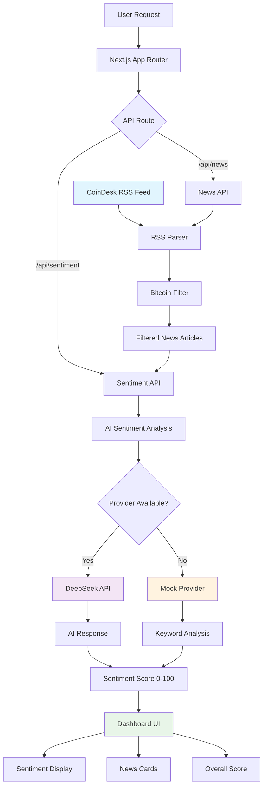
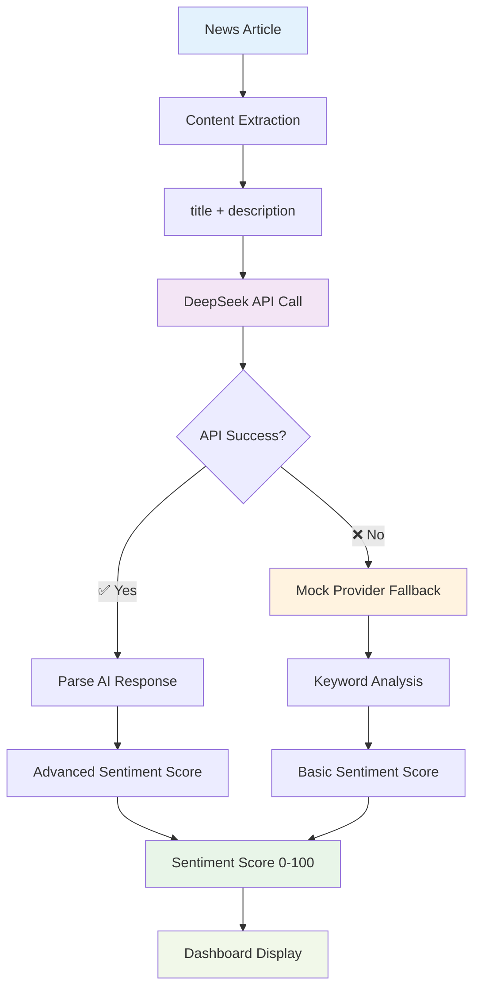
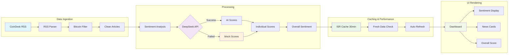

# CryptoMood 📈

**Bitcoin News Sentiment Analyzer MVP**

CryptoMood is a real-time Bitcoin sentiment analysis dashboard that scrapes news from CoinDesk RSS feeds and uses AI to analyze market sentiment. Built with Next.js 14, it provides instant insights into how the crypto community feels about Bitcoin through intelligent news processing.

## 🚀 Live Demo

Visit the dashboard at `http://localhost:3000` after setup.

## 🏗️ Architecture Overview



## 🤖 AI Sentiment Analysis Flow

### Provider Chain Strategy
CryptoMood uses a multi-provider approach with intelligent fallbacks:

```
1. DeepSeek API (Primary)
   ├── Cost-effective (~$0.0014 per analysis)
   ├── High accuracy sentiment scoring
   └── Handles complex financial context

2. Mock Provider (Fallback)
   ├── Keyword-based analysis
   ├── Always available (no API key needed)
   └── Basic but reliable sentiment detection
```

### Analysis Process



### Sentiment Scoring System

- **0-35**: 🔴 **Bearish** - Negative market sentiment
- **36-65**: 🟡 **Neutral** - Balanced or unclear sentiment  
- **66-100**: 🟢 **Bullish** - Positive market sentiment

### AI Prompt Engineering

The DeepSeek API uses carefully crafted prompts for financial context:

```typescript
const prompt = `Analyze the sentiment of this Bitcoin/cryptocurrency news headline and description. 
Consider market implications, regulatory impact, and overall tone.
Return only a number between 0-100 where:
- 0-35: Bearish/Negative sentiment
- 36-65: Neutral sentiment  
- 66-100: Bullish/Positive sentiment`;
```

## 📊 Data Flow Architecture

### Complete System Data Flow



## ✨ Key Features

### Core Functionality
- 🚀 **Real-time Bitcoin news scraping** from CoinDesk RSS feeds
- 🤖 **AI-powered sentiment analysis** with DeepSeek API and intelligent fallback
- 📊 **Visual sentiment dashboard** with overall market sentiment score
- 🔄 **Auto-refresh** every 30 minutes with ISR caching
- 💾 **Graceful fallbacks** when AI providers are unavailable

### UI/UX Features
- 📱 **Mobile-first responsive design** with Tailwind CSS
- ⚡ **Lightning-fast loading** with Next.js 14 App Router
- 🎨 **Color-coded sentiment indicators** (red/yellow/green)
- 📰 **Individual news card analysis** with detailed breakdown
- 📈 **Overall market sentiment overview** with trend indicators

## 🛠️ Tech Stack

- **Frontend**: Next.js 14 (App Router), React, TypeScript
- **Styling**: Tailwind CSS with custom crypto theme colors
- **AI Provider**: DeepSeek API with keyword-based fallback system
- **Data Source**: CoinDesk RSS feeds JSON endpoint
- **Icons**: Lucide React icon library
- **Caching**: ISR (Incremental Static Regeneration)
- **Deployment**: Vercel-ready configuration

## 📦 Installation & Setup

### Prerequisites
- Node.js 18+ 
- npm/yarn package manager

### Quick Start

1. **Clone the repository**
   ```bash
   git clone <repository-url>
   cd CryptoMood
   ```

2. **Install dependencies**
   ```bash
   npm install
   ```

3. **Environment configuration**
   ```bash
   cp .env.example .env.local
   ```

4. **Configure API keys** (optional but recommended)
   ```env
   # .env.local
   DEEPSEEK_API_KEY=your_deepseek_api_key_here
   ```

5. **Start development server**
   ```bash
   npm run dev
   ```

6. **Open dashboard**
   ```
   http://localhost:3000
   ```

## 🔧 Development Commands

```bash
# Development
npm run dev          # Start development server
npm run build        # Build for production  
npm run start        # Start production server
npm run lint         # Run ESLint
npm run type-check   # Run TypeScript checking
```

## 🌐 API Endpoints

### GET `/api/news`
Fetches and filters Bitcoin-related news from CoinDesk RSS feed.

**Response:**
```json
{
  "articles": [
    {
      "title": "Bitcoin Reaches New Heights",
      "description": "Analysis of recent market movements...",
      "link": "https://coindesk.com/...",
      "pubDate": "2024-01-01T12:00:00Z"
    }
  ]
}
```

### POST `/api/sentiment`
Analyzes sentiment for provided news articles.

**Request:**
```json
{
  "articles": [
    {
      "title": "Bitcoin News Title",
      "description": "Article description..."
    }
  ]
}
```

**Response:**
```json
{
  "overallSentiment": 75,
  "articleSentiments": [
    {
      "title": "Bitcoin News Title",
      "sentiment": 75,
      "analysis": "Bullish sentiment detected..."
    }
  ]
}
```

## 🔑 Environment Configuration

The app works without any API keys using a built-in keyword-based fallback, but for AI-powered sentiment analysis, configure:

```env
# .env.local
DEEPSEEK_API_KEY=your_deepseek_api_key_here
```

**Why DeepSeek?**
- **Cost-effective**: ~$0.0014 per analysis (90% cheaper than OpenAI)  
- **Powerful**: Competitive with GPT-3.5/4 for text analysis
- **Reliable**: Stable API with excellent uptime
- **Developer-friendly**: OpenAI-compatible format

## 🔍 Project Structure

```
CryptoMood/
├── app/
│   ├── lib/
│   │   ├── rss-parser.ts      # RSS feed processing & Bitcoin filtering
│   │   └── ai-sentiment.ts    # Multi-provider AI sentiment analysis
│   ├── api/
│   │   ├── news/route.ts      # News fetching API endpoint
│   │   └── sentiment/route.ts # Sentiment analysis API endpoint
│   ├── components/
│   │   ├── Dashboard.tsx      # Main dashboard container
│   │   ├── NewsCard.tsx       # Individual news article cards
│   │   └── SentimentScore.tsx # Overall sentiment display widget
│   ├── page.tsx               # Home page with ISR configuration
│   ├── layout.tsx             # App layout with metadata
│   └── globals.css            # Tailwind + custom crypto theme
├── public/                    # Static assets
├── .env.example              # Environment template
└── README.md                 # This documentation
```

## 🎨 Custom Styling

CryptoMood uses custom Tailwind colors for crypto market sentiment:

```css
/* tailwind.config.js - Custom Theme Colors */
colors: {
  'crypto-green': '#00d4aa',    // Bullish sentiment
  'crypto-red': '#ff4757',      // Bearish sentiment  
  'crypto-yellow': '#ffa502',   // Neutral sentiment
}
```

## ⚡ Performance Optimizations

- **ISR Caching**: 30-minute revalidation for optimal data freshness vs performance
- **Provider Fallbacks**: Ensures 100% uptime even without API keys
- **Efficient Filtering**: Bitcoin-specific keyword filtering reduces processing overhead
- **Component Optimization**: React.memo and strategic re-renders
- **TypeScript**: Compile-time optimizations and runtime error prevention

## 🚀 Deployment

### Vercel (Recommended)
1. Connect your GitHub repository to Vercel
2. Add environment variables in Vercel dashboard:
   ```
   DEEPSEEK_API_KEY=your_production_api_key
   ```
3. Deploy automatically on push to main branch

### Alternative Platforms
```bash
# Build for production
npm run build

# Start production server  
npm run start
```

## 🎯 MVP Scope & Vision

### Current Focus (v1.0)
- **Bitcoin-only analysis** - Focused scope for faster development
- **CoinDesk RSS integration** - Reliable, high-quality news source
- **Real-time sentiment scoring** - 0-100 scale with color coding
- **Responsive dashboard** - Mobile-first design approach
- **Production-ready codebase** - TypeScript, error handling, fallbacks

### Future Roadmap (v2.0+)
- 🪙 **Multi-cryptocurrency support** (Ethereum, Solana, etc.)
- 📰 **Additional news sources** (CoinTelegraph, Decrypt, etc.)
- 📈 **Historical sentiment tracking** with trend analysis
- 💹 **Price correlation analysis** with market data integration
- ⚡ **Real-time WebSocket updates** for live sentiment changes
- 👤 **User customization** - personalized watchlists and alerts
- 🤖 **Enhanced AI models** - Fine-tuned crypto sentiment analysis

## 🤝 Contributing

We welcome contributions! Here's how to get started:

1. **Fork the repository**
2. **Create feature branch**
   ```bash
   git checkout -b feature/amazing-feature
   ```
3. **Commit your changes**
   ```bash
   git commit -m 'Add amazing feature'
   ```
4. **Push to branch**
   ```bash
   git push origin feature/amazing-feature
   ```
5. **Open a Pull Request**

### Contribution Guidelines
- Follow existing code style and TypeScript patterns
- Add tests for new features when applicable
- Update documentation for API changes
- Ensure all CI checks pass

## 🆘 Support & Issues

If you encounter any issues or have questions:

1. **Check existing [Issues](../../issues)** for similar problems
2. **Create a new issue** with detailed description including:
   - Error messages and stack traces
   - Environment details (Node.js version, OS, etc.)
   - Steps to reproduce the issue
3. **Join our discussions** for feature requests and general questions

## 📄 License

This project is licensed under the **MIT License** - see the [LICENSE](LICENSE) file for details.

## 🙏 Acknowledgments

- **CoinDesk** - For providing reliable RSS feeds
- **DeepSeek** - For cost-effective AI sentiment analysis
- **Next.js team** - For the excellent React framework
- **Tailwind CSS** - For rapid UI development
- **Vercel** - For seamless deployment platform

---

**Built with ❤️ for the crypto community**

*CryptoMood - Making Bitcoin sentiment analysis accessible to everyone*

[](https://vercel.com/new/clone?repository-url=https://github.com/yourusername/cryptomood)
[](https://nextjs.org/)
[](https://www.deepseek.com/)